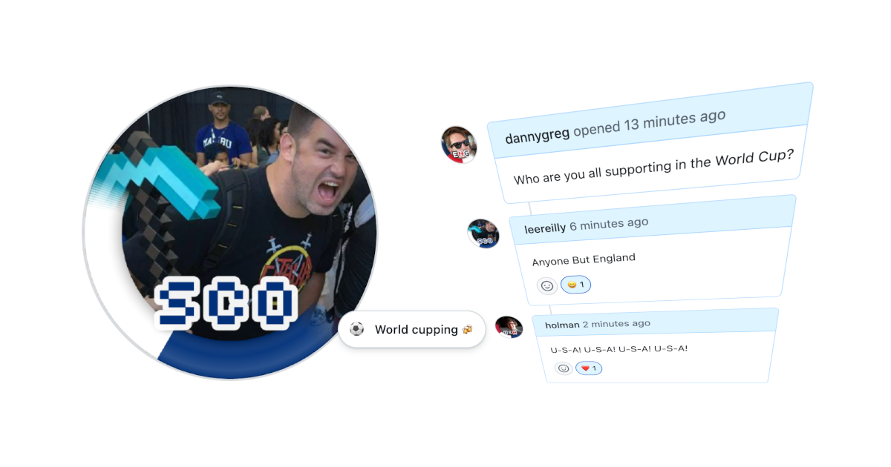
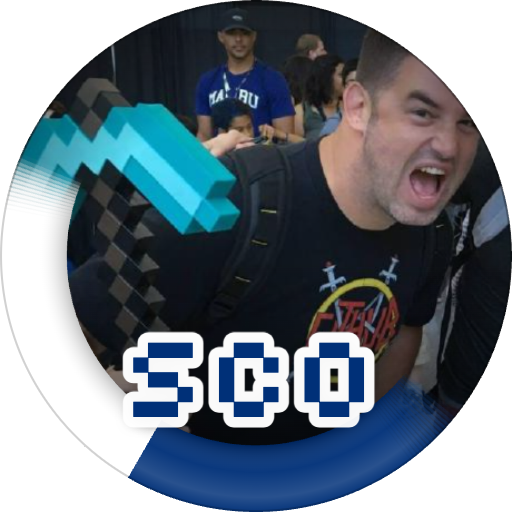

# ⚽ FanFrame — World Cup 2026 Avatar Generator



Generate a custom GitHub avatar with your favorite World Cup 2026 team's colors!

Enter your GitHub username, pick a team, and download a PNG with a team-colored ribbon along the lower edge and a country code.

## Examples

A few GitHub friends repping their teams — generated with FanFrame:

<table>
  <tr>
    <td align="center" width="20%">
      <br>
      <a href="https://github.com/leereilly">@leereilly</a><br>
      <sub>🏴󠁧󠁢󠁳󠁣󠁴󠁿 Scotland</sub>
    </td>
    <td align="center" width="20%">
      <br>
      <a href="https://github.com/cassidoo">@cassidoo</a><br>
      <sub>🇺🇸 USA</sub>
    </td>
    <td align="center" width="20%">
      <br>
      <a href="https://github.com/MartinWoodward">@MartinWoodward</a><br>
      <sub>🏴󠁧󠁢󠁥󠁮󠁧󠁿 England</sub>
    </td>
    <td align="center" width="20%">
      <br>
      <a href="https://github.com/abbycabs">@abbycabs</a><br>
      <sub>🇨🇦 Canada</sub>
    </td>
    <td align="center" width="20%">
      <br>
      <a href="https://github.com/ChrisReddington">@ChrisReddington</a><br>
      <sub>🏴󠁧󠁢󠁷󠁬󠁳󠁿 Wales</sub>
    </td>
  </tr>
</table>

## Features

- 🏟️ All 48 World Cup 2026 qualified teams
- 🎨 Team-colored ribbon (LinkedIn #OPENTOWORK-style) that fades along the avatar's edge
- 🏷️ 3-letter FIFA country code badge
- 🖼️ Drag &amp; drop or upload your own square image (stays in your browser)
- ⬇️ One-click PNG download
- 🌙 Dark, modern UI
- 📱 Mobile-friendly

## Usage

1. Visit the [live site](https://leereilly.github.io/fanframe-world-cup-2026/)
2. Enter a GitHub username, paste a profile image URL, or drag &amp; drop / upload a square image
3. Select a team
4. Click **Generate Avatar**
5. Click **Download PNG**

## Local Development

Just open `index.html` in your browser — no build step required.

```sh
open index.html
```

## Deployment

Deployed automatically to GitHub Pages on push to `main`.

## License

MIT
